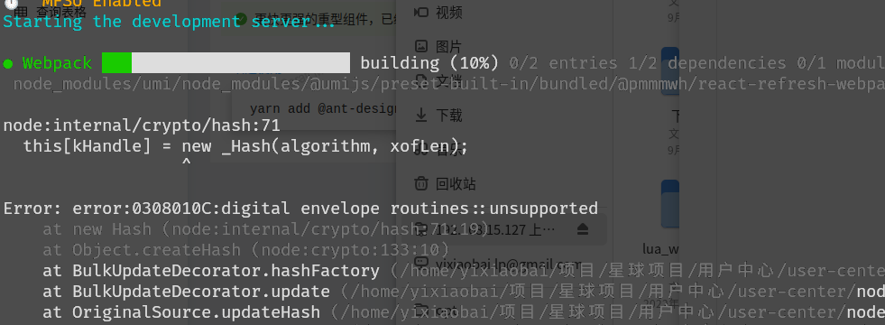
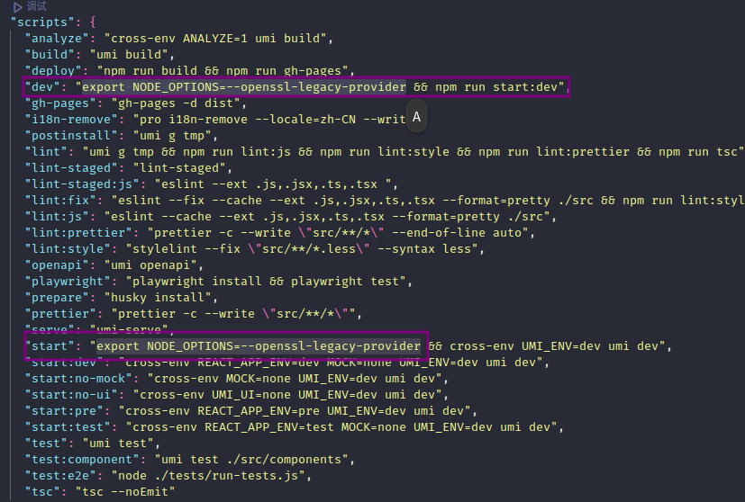

# user-center-backend
# 用户中心项目
### 知识星球中的第一项目

### 企业做项目流程

### 需求分析 => 设计（概要设计、详细设计）=> 技术选型 => 初始化/引入需要的技术 => 写Demo => 写代码（实现业务逻辑）=> 测试（单元测试）=> 代码提交/代码评审 => 部署发布
## 需求分析

1. 登录/注册
2. 用户管理（仅管理员可见）
3. 用户校验

## 技术选型

#### 前端：三件套 + React + 组件库 Ant Design + Umi （ui库）+ Ant Design Pro（现成的管理系统）

#### 后端：java + spring + springmvc +mybatis + mybatis-plus + spring boot + mysql

#### 部署：服务器/容器（平台）
---
## 计划

##### 前端初始化

1. 初始化项目

    1. 使用命令 `pro create myapp # 项目名称`
    2. 启动项目 `yarn start/dev` 或 `npm start/dev`

        1. 启动出错时
        2. 
        3. 需要给启动命令上添加相关代码

            1. Linux系统： `export NODE_OPTIONS=--openssl-legacy-provider`
            2. Windows 系统： `set NODE_OPTIONS=--openssl-legacy-provider`

                
    3. 添加 ui框架

        1. 使用命令 `yarn add @umijs/preset-ui -D` 可以帮助我们创建一些代码
        2.
2. 引入一些组件之类的
3. 框架介绍 / 项目瘦身

##### 后端初始化

1. 准备环境（MySQL之类的）
2. 引入框架（整合框架）
